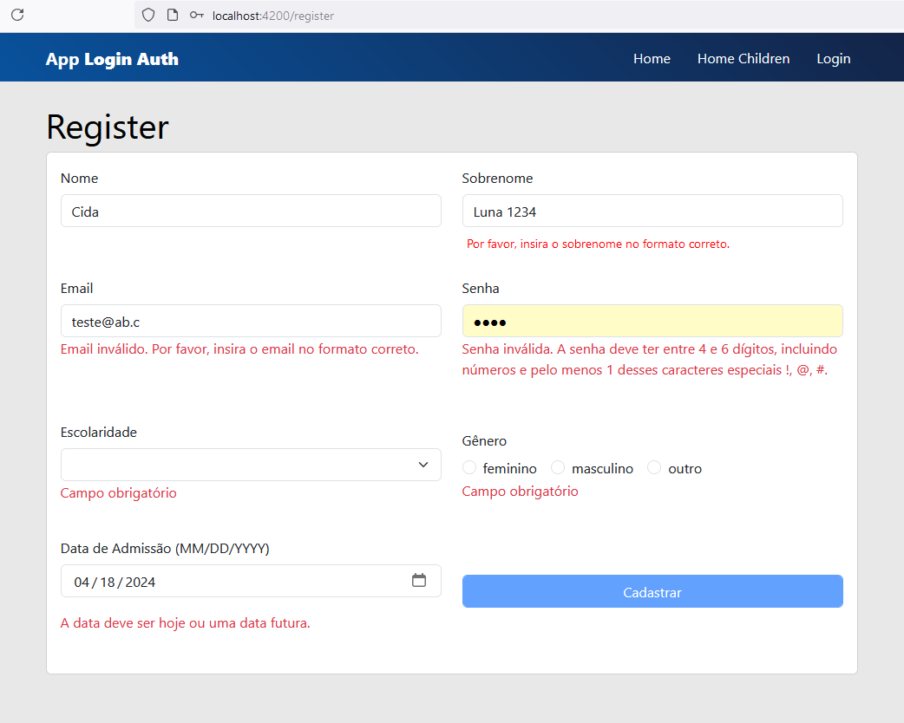

# Autenticação Login/Logout utilizando JSON Server (em desenvolvimento)

Esta é uma aplicação base em Angular 17 que apresenta um fluxo de cadastro e login/logout. Utilizando boas práticas de estrutura de projeto, componentes de cadastro, login, logout, autenticação, rotas protegidas, interceptor e API JSON Server.

O fluxo da aplicação inicia na página de boas vindas Home, permitindo o usuário clicar no link Login, inserir as credenciais e ser direcionado para as rotas protegidas.

## Como rodar a aplicação Angular:

1. **Clone o repositório:**
  ```bash
    git clone https://github.com/cidaluna/login-auth-angular-using-json-server.git
  ```

2. **Navegue no diretório principal**
```bash
  cd login-auth-angular-using-json-server
```

3. **Execute o comando JSON Server para acesso a API Backend provisório**
```bash
  json-server --watch db.json
```

4. **Abra outro terminal, dentro do diretório do projeto e execute o comando**
  ```bash 
    npm install
  ```

5. **Execute a aplicação Angular**
  ```bash 
    ng serve
  ```

6. **Navegue na URL que o comando anterior apresentou**

Após rodar os comandos anteriores, a aplicação estará disponível em: http://localhost:4200


## Como rodar os testes Cypress/e2e:

1. **Navegue até o diretório principal**
```bash
   cd login-auth-angular-using-json-server
```

2. **No diretório principal, execute o comando**
```bash
  npx cypress open
```

3. **Será aberta uma tela, clique na opção E2E Testing**

4. **Clique no navegador de sua preferência e clique em Start**

5. **Clique em login.cy.js**

6. **Acompanhe o resultado dos testes Cypress na tela**

7. **Caso queira, rode o Cypress apenas no terminal**
```bash
  npx cypress run
```


### Pre-Requisitos
- Node.js 18
- Angular CLI 17

### Tecnologias

- Angular 17, 
- Bootstrap 5.3
- Node.js,
- JSON Server,
- Jasmine Karma
- Cypress E2E


## Sobre CORS:

É comum a aplicação Front-end rodar em um determinado domínio URL, e a aplicação Back-end rodar em outro domínio diferente. E no momento de integração das aplicações, pode ocorrer que a requisição do Front-end ao Back-end seja bloqueada pelo navegador, pela política de segurança CORS (Cross-Origin Resource Sharing, ou Compartilhamento de Recursos entre Origens Diferentes). Esse bloqueio CORS ocorre apenas no navegador, pois o navegador faz uma requisição antecipada, conhecida como Preflight, essa mesma requisição Preflight não ocorre no Postman ou outros ambientes, por isso precisa ser bem configurada no Back-end.

Confira se o Back-end possui configurado as políticas de CORS, quais são os cabeçalhos aceitos 'Access-Control-Allow-Headers: content-type, x-custom-teste', quais são os verbos HTTP aceitos exemplo 'Access-Control-Allow-Methods: PUT, PATCH', inclusive peça para ser adicionado a origem do Front-end com o 'Access-Control-Allow-Origin: http://endereco.do.seu.frontend:4200' e conheça as regras de segurança, para que as requisições consigam consumir os recursos autorizados.

Para resolver esse problema no Front-end, em tempo de desenvolvimento local, foi criado o arquivo proxy.conf.json que contem o endereço padrão da API JSON Server configurado no target http://localhost:3000. 

### Problema sem o proxy

Se você fizer uma requisição diretamente por exemplo para http://localhost:3000/users a partir do frontend em http://localhost:4200, isso vai gerar um problema de CORS. O navegador bloqueia a requisição porque está sendo feita para um domínio diferente.

### Solução com o proxy

Com o proxy configurado, você faz uma chamada para http://localhost:4200/api/users, e o Angular CLI redireciona isso internamente para http://localhost:3000/users, resolvendo o problema de CORS sem precisar configurar cabeçalhos especiais no Back-end, por enquanto.

### Proxy somente em ambiente de Desenvolvimento

O proxy é ideal para desenvolvimento, mas em produção, as chamadas devem ser feitas diretamente para o backend real. Usar um proxy em produção pode adicionar latência e complexidade desnecessária.


## Screenshots

Tela de Login:


Tela de Cadastro com algumas validações:



Tela de Testes End-2-End com Cypress no Login


